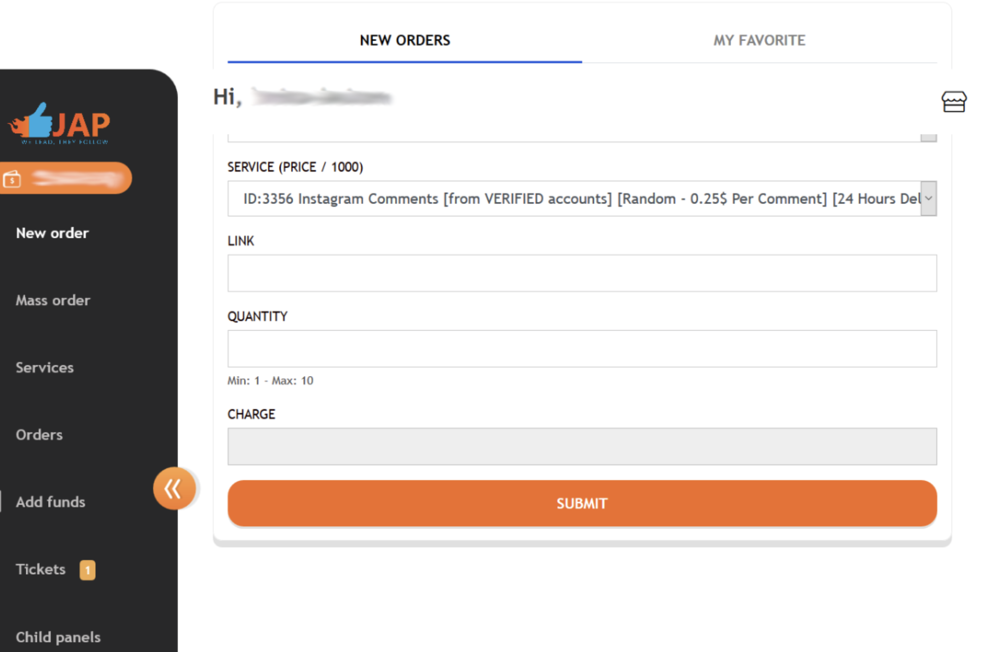

# Purchasing Good Enough Followers

For our project we used JustAnotherPanel.com, one of the biggest vendors of social media
followers on the market. This guide will walk you through the process of buying followers from
there and some of the considerations we made.

JustAnotherPanel interface.

Start by registering an account at justanotherpanel.com. Find a way to top up your balance,
listed under the ‘Add funds’ menu, seen on the picture above. BitCoin transfer should be the
most straightforward, but we used Wester Union for our project, and some other options exist as
well, but credit cards or PayPal will not be accepted so keep that in mind. A small bonus of
around 5% is generally added to the amount that you transfer. Once the balance is registered,
you can go ahead and start ordering followers (as well as other social media services, such as
likes, engagements, media plays, and much more).
There are countless different qualities of followers. For this reason, we grouped them together
based on their most distinguished quality and chose five from each category in order to have as
representative of a sample as possible. We found three main categories, which were:

1. **Authenticity**: These types of followers are sold and priced accordingly to their
authenticity. Here we found followers branded as ‘Real Looking’, ‘Real and Engaging’,
‘Super VIP’ and even ‘Low Quality’. The difference in quality often, but not always,
indicates whether or not the follower will have a profile picture, post history or other
markers of authenticity.

2. **Spatial/Location**: These types of followers are marketed based on their
nationality/language. Here we find Russian, Brazilian, Turkish, Iranian or Spanish
followers for example. Other special categories include gendered followers or from a
specific region.

3. **Temporal qualities**: These followers are sold for their special temporalities. Here we
found followers who are marketed for their stability (‘low-drop’) or lack thereof (high-
drop), for their delivery times (‘Instant’) or their transient qualities (for example ‘prank
followers’ that vanish after the delivery, to mock the recipient).

Once you have made your selection you can place the order by copying and pasting the link of
your recipient account to the ordering form and set the quantity needed (be aware that not all
services are sold in all quantities, some are sold in fixed quantities and some have limits in
minimum/maximum numbers). Once you press order, JustAnotherPanel will start processing the
order, and you can find the order status under the ‘Orders’ menu. If you run into problems, you
can contact the support by placing a ticket under the ‘Ticket menu’.
