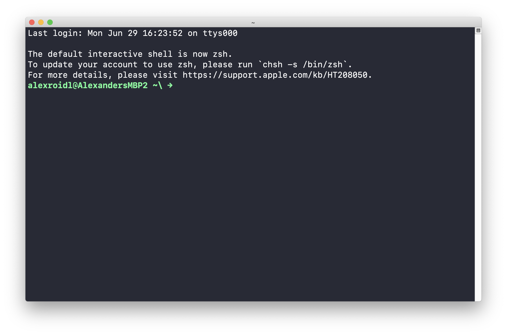
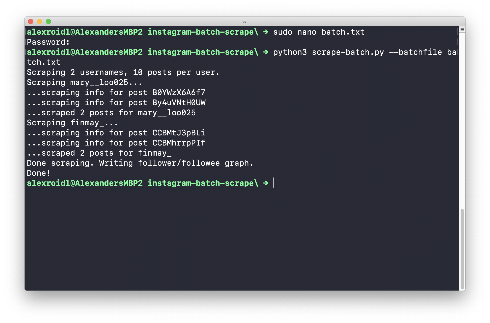

# Using the DMI instagram batch scrape tool

This is (hopefully) a beginner friendly guide to scrape instagram accounts using the Digital Methods Initiative instagram batch scrape tool.

More infos here: [https://github.com/digitalmethodsinitiative/instagram-batch-scrape](https://github.com/digitalmethodsinitiative/instagram-batch-scrape)

### 1 Setup requirements

For the most steps you will need to use the command line interface, use the terminal app if you are on Mac or Linux, use the Command Prompt if on Windows.

#### 1.1 Install python3
If you haven't yet installed python 3, you need to do this first. 
Follow the tutorial for either Linux, Mac or Windows:

[https://realpython.com/installing-python/]()

#### 1.2 Open the terminal




#### 1.3 Clone the git repository
Type the following (in the grey boxes) in your terminal

Clone the git repository (this is a fork of the offical repository, so we can mess with the code)

```bash
git clone https://github.com/alexanderroidlhhs/instagram-batch-scrape.git
```

(Note: if you want to switch to a different folder, use the cd command)


#### 1.4 Install python dependencies
```bash
cd instagram-batch-scrape
```

```bash
pip3 install -r requirements.txt
```

### 2 Setup Configuration
You can do this either from the command line or just edit the files directly using e.g. finder, the graphical user interface.

#### 2.1 graphical user interface

1. open the folder you downloaded the script to (usually should be your user / home folder)
2. copy the file `config.py-example` and rename it to `config.py`
3. open the file and enter your username and password into this file
4. create a text file in the same folder called `batch.txt`
5. in this file you enter the accounts you want to scrape (one account-name per line)


#### 2.2 command line interface (mac and linux only)

Copy config example file to config.py

```bash
cp config.py-example config.py
```


fill in username and password (and number of posts)

```bash
sudo nano config.py
```

create and edit batch.txt: in this file you enter the accounts you want to scrape (one account-name per line)

```bash
sudo nano batch.txt
```


### 3 Run the script

```bash
python3 scrape-batch.py --batchfile batch.txt
```

The result should look something like this. 



The script exports the results as two CSV files and a graph file (located in the same folder as the script is in):

* One CSV file (accounts.csv) containing one row per scraped username, with metadata such as biography, number of followers, number of posts, et cetera
* One CSV file (posts.csv) containing one row per post, with metadata such as post URL, caption, hashtags, likes, et cetera
* One Gephi-compatible GDF file (follower-network.gdf) containing a graph representing followers and followees for each account. This is a directed graph with accounts as nodes, and directed edges representing follower/followee relationships. If account internetperson follows account webuser, an edge from internetperson to webuser is created.


### 4 Schedule the script (OPTIONAL)

If you want to track changes over time, it might be of insterest to schedule the script (run it every 30 minutes)

The following only works on Unix-based systems (Mac & Linux) so not on Windows. 

For Windows maybe this helps: [https://www.windowscentral.com/how-create-task-using-task-scheduler-command-prompt](https://www.windowscentral.com/how-create-task-using-task-scheduler-command-prompt)


create a crontab for your user:
```bash
env EDITOR=nano crontab -e
```

in this file enter:

```bash
PATH=/usr/local/bin:/usr/bin:/bin 
```

```bash
*/30 * * * * cd ~/projects/instagram-batch-scrape/ && python3 scrape-batch.py --batchfile batch.txt -t TRUE   >> ~/projects/instagram-batch-scrape/script_output.log
```
**! replace ~/projects/instagram-batch-scrape/ with the path to your script folder !**

*/30 * * * * stands for every 30th minute, 
so you can change this to 10 if you want it to run every 10th minute. 

save using ctrl-c and confirm with y 

If on macOS you might get a popup asking for permission. In order for the script to work you have to accept this
