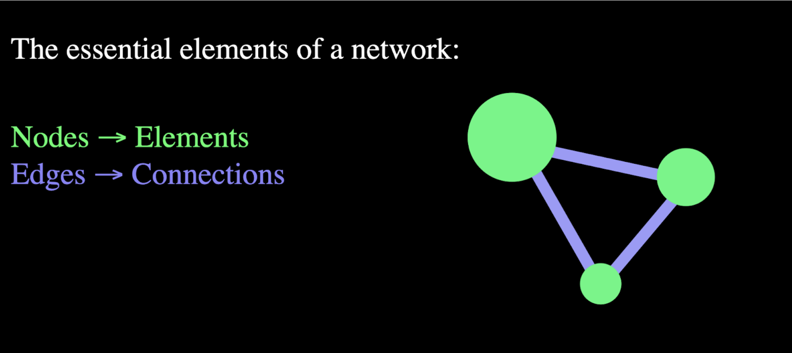
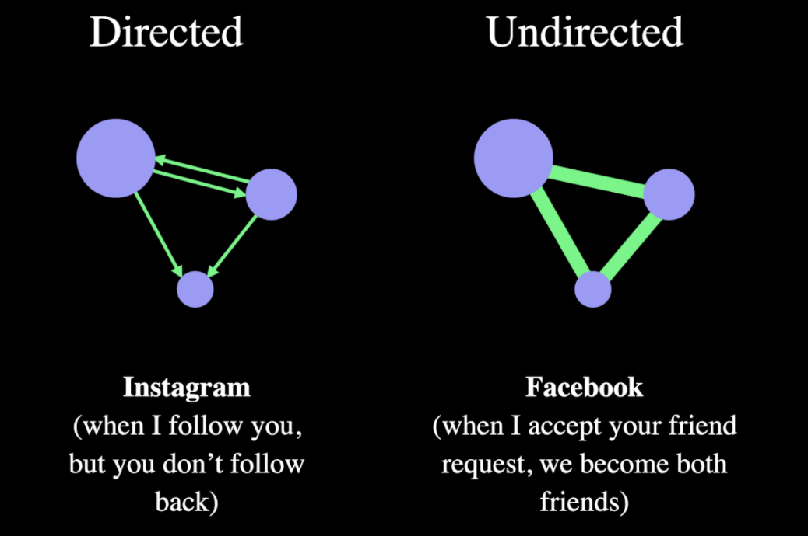
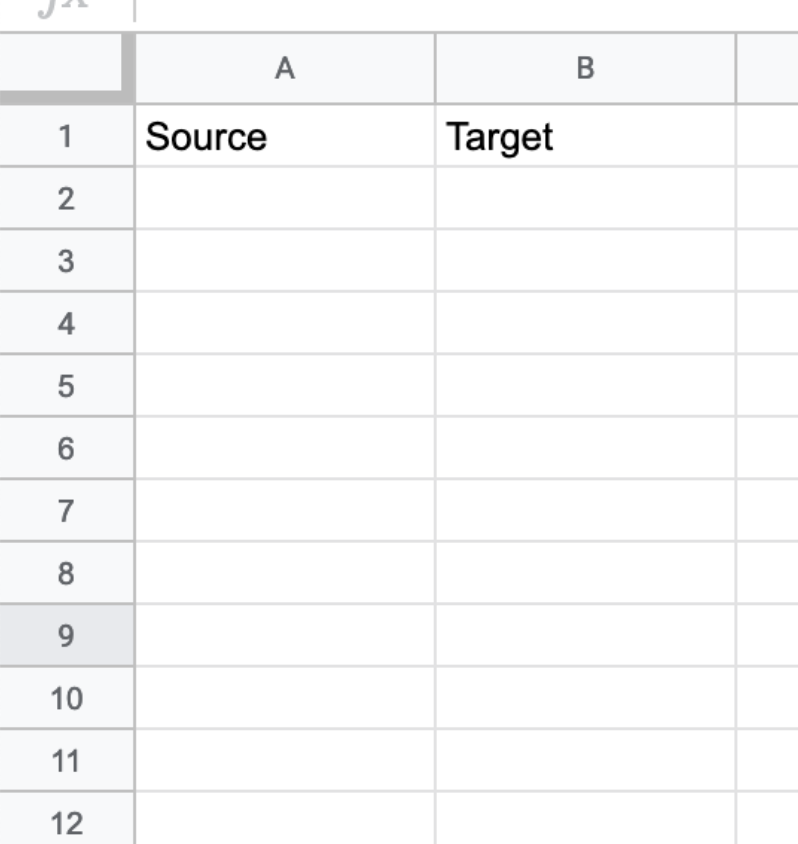

# Gephi Network - Dataset Creation
## Introduction:

A network is a system of connected elements:

There are 3 kinds of a network: directed, undirected, mixed.

Think about: why visualize, which elements, what are the relationship between the elements
Gather (if there are) the different data sources

## Creation of the dataset:

* Create a new google spreadsheet
* Rename the cells A1: Source, B1: Target, like so 

* fill for each row all the connections. Every connection is made by two elements: a source and a target. In this case, the network we are building is directed so in the source column put the elements that follow, while on the target column put the elements that are being followed. 

Please note: use always the same text for each element. We can’t use the instagram URL and the username for the same entity. Otherwise there will be displayed two different nodes of the same entity/account.
